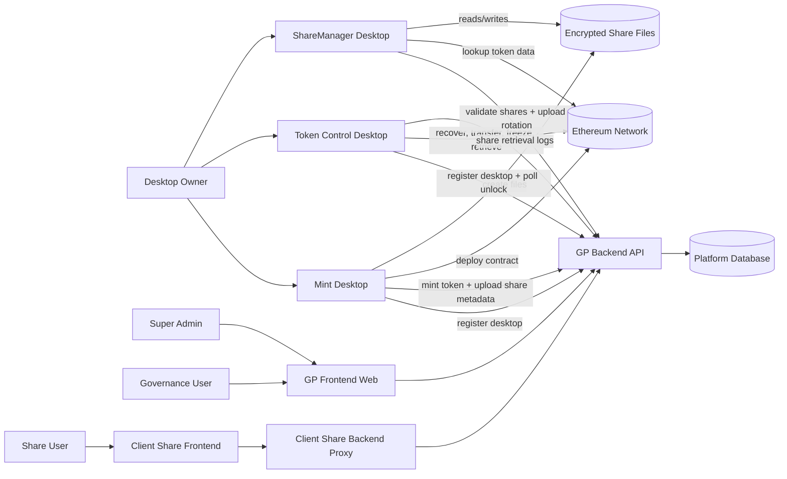
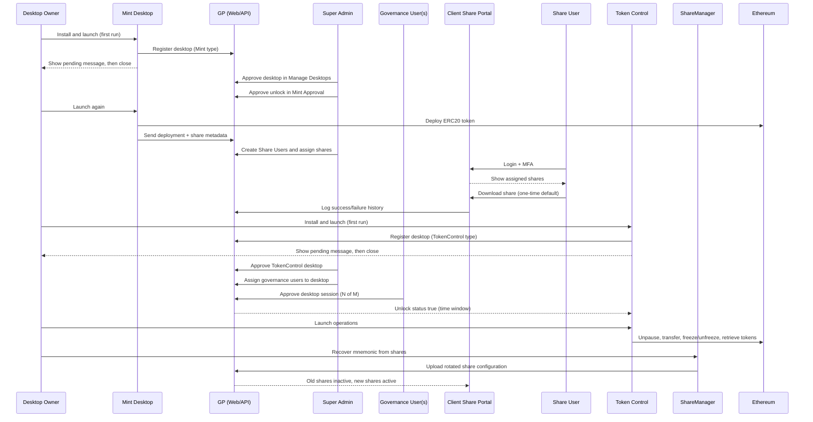
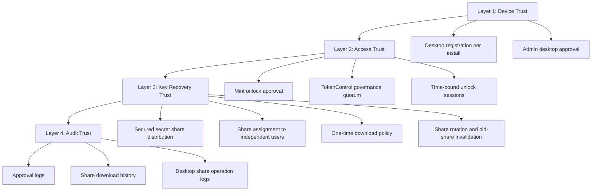
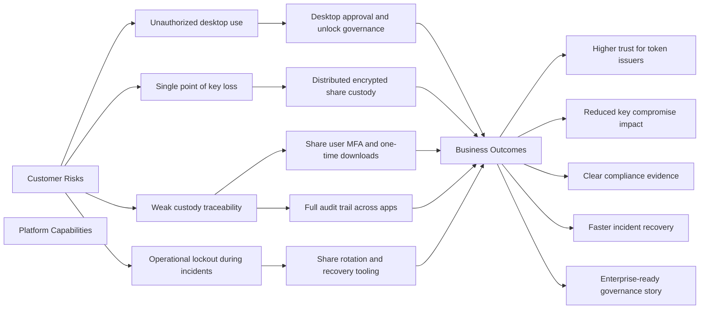

# AegisMint Flowcharts and Stakeholder Diagrams

This document provides visuals for engineering, operations, and stakeholder communication.

---

## 1) Cross-Application Connection Flowchart

---

## 2) End-to-End Lifecycle Sequence (Install to Recovery)

---

## 3) Trust and Control Layers (Security Story)

---

## 4) Stakeholder Value Diagram 

---

## Suggested Usage

- Use Diagram 1 for technical architecture walkthroughs.
- Use Diagram 2 for QA/UAT kickoff and go-live readiness.
- Use Diagram 3 for security and governance discussions.
- Use Diagram 4 for executive and customer-facing presentations.
