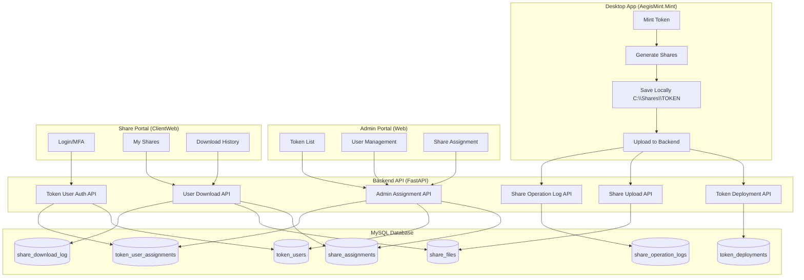
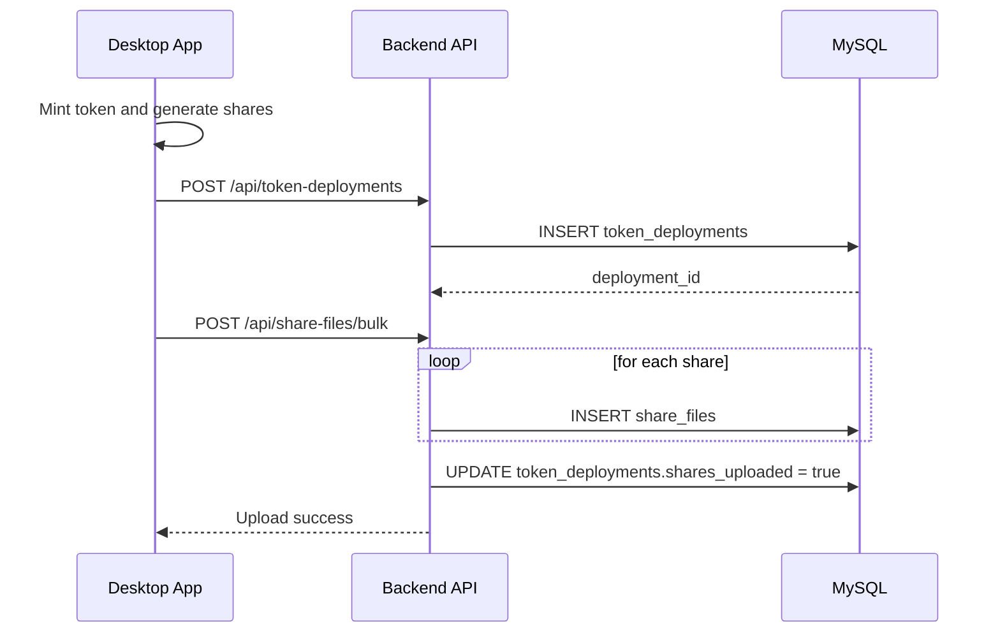
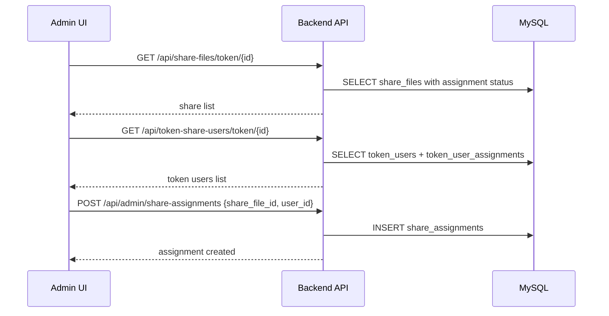
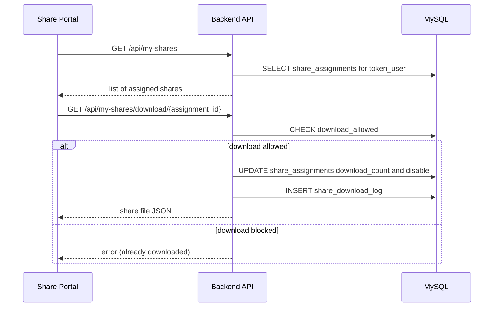
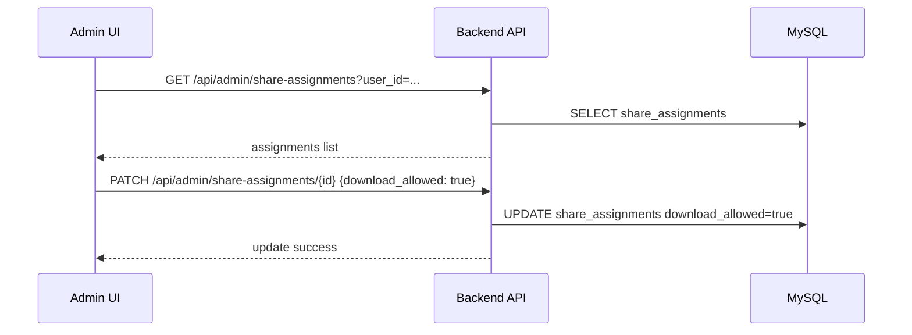

# Aegis Mint - Share Management System

Version: 1.2
Created: 2026-01-24
Last Updated: 2026-01-26

## Purpose
Build a secure web-based system for managing and distributing Encryption recovery shares with admin oversight, MFA, and complete audit trails.

## Current State
- Shares are stored individually in `share_files`.
- Token users are global by email and can be assigned to multiple tokens via `token_user_assignments`.
- Admins assign shares to token users; downloads are one-time by default and audited.

## Architecture Overview
- Desktop (AegisMint.Mint) generates shares and uploads them to the backend.
- Web Admin (Web) manages tokens, token users, and share assignments.
- Share Portal (ClientWeb) lets token users authenticate with MFA and download their assigned shares.
- ClientWeb backend is a proxy that forwards requests to the main backend.

### Architecture Diagram

## End-to-End Flows (Summary)

### 1) Share Upload
1. Desktop mints token and generates N share files.
2. Desktop posts token deployment metadata.
3. Desktop uploads share files in bulk to `/api/share-files/bulk`.
4. Backend stores each share and updates `token_deployments.shares_uploaded`.

### 2) Admin Assignment
1. Admin selects a token and views its shares.
2. Admin creates or selects a token user (global email).
3. Admin assigns a share to the user.
4. Assignment is tracked in `share_assignments` and visible to the user.

### 3) User Download
1. Token user logs in with email + password + MFA.
2. User views assigned shares.
3. User downloads a share (one-time by default).
4. Backend disables the download and writes to `share_download_log`.

### 4) Admin Re-enable
1. Admin re-enables a share download when requested.
2. User can download again and the action is logged.

## Implementation Status (Phases)

### Phase 1: Database and Core API (Complete)
- [x] `share_files`, `share_assignments`, `share_download_log`, `share_operation_logs`
- [x] `token_users` + `token_user_assignments` (migration 019)
- [x] Share upload, assignment, and download endpoints

### Phase 2: Desktop Integration (Complete)
- [x] Upload individual share files with retry logic
- [x] Token deployment metadata upload

### Phase 3: Admin Portal UI (Complete)
- [x] Token list with share upload status
- [x] Token user management (create/edit/delete assignment)
- [x] Share assignment and re-enable actions

### Phase 4: Token User Portal (Complete)
- [x] Login + MFA setup and verification
- [x] Multi-token selection
- [x] Assigned shares dashboard
- [x] Download flow with auto-disable
- [x] Download history view

### Phase 5: Advanced Features (Backlog)
- [ ] Share expiration dates
- [ ] Bulk assignment operations
- [ ] Share transfer between users (with approval)
- [ ] Export audit reports
- [ ] Notifications (email/Slack)
- [ ] Emergency revocation (disable all downloads quickly)

## Audit Notes
- Admin assignment actions are recorded in `share_assignments` (assigned_by, assigned_at_utc).
- User download attempts are recorded in `share_download_log` with IP and user agent.
- Desktop creation/retrieval events are recorded in `share_operation_logs`.

## Next Work
- Produce a user-facing test plan (see `TEST-PLAN-USER-FRIENDLY.md` as the template).
