# Aegis Mint - Share Management System

**Version:** 1.1  
**Created:** 2026-01-24  
**Last Updated:** 2026-01-24

---

## 🎯 Purpose

Create a secure web-based system for managing and distributing Shamir secret shares to governance authority users, with admin oversight and download tracking.

### Key Features
- **Admin:** Assign shares to users, manage permissions, view audit logs
- **User:** Download assigned shares (one-time by default), view history
- **Security:** MFA, role-based access, complete audit trail

---

## 📊 Current State

**Problem:** Desktop app generates shares as individual files (`C:\Shares\{TOKEN}\aegis-share-001.json`) but backend only stores them as one encrypted blob in `token_deployments.encrypted_shares`.

**Solution:** Store each share separately in database with individual assignment tracking.

**Database:** MySQL

---

## 🏗️ System Architecture

### Architecture Explanation

**Desktop Flow:**
1. User mints token via desktop app
2. App generates N shares using Shamir Secret Sharing
3. Shares saved locally in `C:\Shares\{TOKEN-NAME}\`
4. App uploads token metadata to backend
5. App uploads individual shares to backend

**Admin Flow:**
1. Admin views all tokens and their shares
2. Admin selects unassigned share
3. Admin assigns share to specific user
4. Assignment logged in audit trail

**User Flow:**
1. User logs in with MFA
2. User sees assigned shares
3. User downloads share (auto-disabled after download)
4. Download logged for audit

---

## 💾 Database Tables

### New Tables (MySQL)

**`share_files`** - Individual encrypted shares
- Links to `token_deployments`
- Each row = one share file
- Stores encrypted content

**`share_assignments`** - Who gets which share
- Links share to user
- Tracks download status and count
- One share per user (UNIQUE constraint)

**`share_download_log`** - Complete audit trail
- Every download attempt logged
- Stores IP, user agent, timestamp
- Cannot be deleted (immutable audit)

### Updated Table

**`token_deployments`** - Added columns:
- `shares_uploaded` - Boolean flag
- `upload_completed_at_utc` - When shares were uploaded
- `share_files_count` - Number of shares uploaded

---

## 🔄 Detailed Flow Diagrams

### Flow 1: Token Deployment & Share Upload

**Explanation:**
1. Desktop app mints token and generates shares using Shamir Secret Sharing
2. Shares saved locally to C:\Shares\{TOKEN-NAME}\
3. Desktop uploads token deployment metadata
4. Desktop uploads all shares in bulk to backend
5. Backend stores each share separately in database

---

### Flow 2: Admin Assigns Share to User

```mermaid
sequenceDiagram
    participant Admin as Admin UI
    participant API as Backend API
    participant DB as MySQL
    
    Admin->>API: GET /api/admin/tokens
    API->>DB: SELECT token_deployments
    API-->>Admin: List of tokens
    
    Admin->>Admin: Select Token X
    
    Admin->>API: GET /api/share-files/token/{id}
    API->>DB: SELECT share_files<br/>with assignment status
    API-->>Admin: [Share #1 ✅ assigned]<br/>[Share #2 ⭕ unassigned]<br/>[Share #3 ⭕ unassigned]
    
    Admin->>Admin: Select Share #2
    Admin->>Admin: Select User Y
    
    Admin->>API: POST /api/admin/share-assignments<br/>{share_file_id, user_id}
    API->>DB: INSERT share_assignments
    API->>DB: INSERT share_operation_log
    API-->>Admin: ✅ Assigned
    
    Note over Admin,DB: Admin can also:<br/>- Unassign shares<br/>- Re-enable downloads<br/>- View assignment history
```

**Explanation:**
1. Admin views all tokens in the system
2. Admin selects a token to manage its shares
3. API shows which shares are assigned/unassigned
4. Admin picks unassigned share and target user
5. System creates assignment and logs the action
6. User can now see and download this share

---

### Flow 3: User Downloads Share

```mermaid
sequenceDiagram
    participant User as User Portal
    participant API as Backend API
    participant DB as MySQL
    
    User->>API: GET /api/my-shares<br/>(with MFA token)
    API->>DB: SELECT share_assignments<br/>WHERE user_id = current
    API-->>User: [Token X - Share #2]<br/>✅ Available
    
    User->>User: Click Download
    
    User->>API: GET /api/share-download/{id}
    API->>DB: CHECK download_allowed
    
    alt Download Allowed
        API->>DB: SELECT encrypted_content
        API->>DB: UPDATE download_count++
        API->>DB: SET download_allowed=FALSE
        API->>DB: INSERT share_download_log
        API-->>User: aegis-share-002.json
        User->>User: Save to disk
        Note over User: ⚠️ Share now disabled<br/>until admin re-enables
    else Download Blocked
        API-->>User: ❌ Error: Already downloaded
    end
```

**Explanation:**
1. User logs in with MFA and views assigned shares
2. User clicks download button for a share
3. API checks if download is allowed
4. If allowed: User gets file, download counter increments
5. **Important:** After first download, `download_allowed=FALSE`
6. User cannot download again unless admin re-enables
7. All attempts logged in `share_download_log`

---

### Flow 4: Admin Re-enables Download

**Explanation:**
1. User contacts admin (lost file, needs re-download)
2. Admin views user's assignment history
3. Admin sees share was downloaded and is now blocked
4. Admin re-enables download permission
5. Action is logged for audit trail
6. User can now download the share again

---

## 📝 Implementation Status
4. A� Implementation Status

### ✅ Phase 1: Database & Backend API (Completed)

**Database:**
- ✅ Created migration `010_add_share_management_tables`
- ✅ Tables: `share_files`, `share_assignments`, `share_download_log`
- ✅ Updated `token_deployments` with upload tracking
- ✅ Migration applied to MySQL database

**Backend APIs:**
- ✅ `POST /api/share-files/bulk` - Bulk upload from desktop
- ✅ `GET /api/share-files/token/{id}` - Get shares for token
- ✅ `POST /api/admin/share-assignments` - Assign share to user
- ✅ `GET /api/admin/share-assignments` - List assignments
- ✅ `PATCH /api/admin/share-assignments/{id}` - Update assignment
- ✅ `DELETE /api/admin/share-assignments/{id}` - Unassign share

**SQLAlchemy Models:**
- ✅ `ShareFile`, `ShareAssignment`, `ShareDownloadLog`
- ✅ Relationships configured with cascade deletes

### ✅ Phase 2: User Download API (Completed)
- ✅ `GET /api/my-shares` - List user's assigned shares
- ✅ `GET /api/my-shares/download/{assignment_id}` - Download share file
- ✅ `GET /api/my-shares/history` - View download history
- ✅ Routers registered in main application

### ✅ Phase 3: Desktop App Integration (Completed)
- ✅ Modified `MainWindow.xaml.cs` to call bulk upload API after share generation
- ✅ Added progress indicator for upload (WebView events: `upload-starting`, `upload-progress`, `upload-complete`)
- ✅ Implemented error handling with detailed logging and user notifications
- ✅ Auto-lookup of token deployment ID by contract address
- ✅ Share encryption before upload using vault manager

### ✅ Phase 4: Admin UI (Completed)
- ✅ **TokensListPage** - View all token deployments with share upload status, filter and search capabilities
- ✅ **ShareAssignmentPage** - Manage share assignments: assign/unassign shares, re-enable downloads, view status
- ✅ **API Integration** - Full TypeScript API client in `shares.ts` with all CRUD operations
- ✅ **Navigation** - Added "Share Management" tab in Admin Console sidebar
- ✅ **Routes** - `/admin/tokens` and `/admin/tokens/:tokenId/shares`

### 🚧 Phase 5: User UI (To Do)
- [ ] Login with MFA
- [ ] My Shares dashboard
- [ ] Download interface
   - MFA verification before download
   - IP address and user agent logged

### Audit Trail
- Every assignment: WHO assigned WHAT to WHOM and WHEN
- Every download: WHO downloaded WHAT from WHERE and WHEN
- Every status change: WHO enabled/disabled downloads WHEN
- Immutable logs (no DELETE allowed)

### Download Policies
- **One-time Download (Default):** `download_allowed` set to FALSE after first download
- **Re-enable:** Admin can set `download_allowed` back to TRUE
- **Multi-download:** Admin can configure assignment to allow unlimited downloads
- **Expiration:** (Future) Add `expires_at_utc` column for time-limited access

---

## 📅 Implementation Phases

### Phase 1: Database & Core API ✅ (Current Phase)
- [x] Design database schema
- [x] Create flowchart document
- [ ] Create Alembic migration for new tables
- [ ] Implement share_files upload endpoint
- [ ] Implement admin CRUD endpoints
- [ ] Implement user download endpoints
- [ ] Add unit tests

### Phase 2: Desktop App Integration
- [ ] Modify `MainWindow.xaml.cs` to upload shares individually
- [ ] Add progress indicator for share upload
- [ ] Add error handling for upload failures
- [ ] Keep backward compatibility with encrypted_shares column

### Phase 3: Admin Portal UI
- [ ] Create token list view with filters
- [ ] Create share assignment interface
- [ ] Create user management interface
- [ ] Create audit log viewer
- [ ] Add real-time notifications

### Phase 4: User Portal UI
- [ ] Create user login with MFA
- [ ] Create "My Shares" dashboard
- [ ] Create download interface with confirmation
- [ ] Create download history view
- [ ] Add email notifications on assignment

### Phase 5: Advanced Features
- [ ] Share expiration dates
- [ ] Bulk assignment operations
- [ ] Share transfer between users (with approval)
- [ ] Export audit reports
- [ ] Telegram/Slack notifications
- [ ] Emergency revocation (admin can instantly disable all shares)

---

## 📊 Metrics & Monitoring

### Key Metrics to Track
- Total tokens deployed
- Total shares created
- Assignment rate (assigned vs unassigned)
- Download rate (downloaded vs available)
- Average time between assignment and download
- Failed download attempts
- Admin actions per day

### Alerts
- Unassigned shares older than 7 days
- Failed download attempts (potential attack)
- High number of re-enable requests (suspicious)
- Sh� Key Security Points

1. **One-Time Download:** By default, shares can only be downloaded once
2. **Admin Control:** Only SuperAdmin can manage assignments
3. **Audit Trail:** Every action is logged (who, what, when, where)
4. **MFA Required:** Both admin and user operations require MFA
5. **Encrypted Storage:** Shares stored encrypted in database
6. **Role-Based Access:** Users can only see/download their own shares

---

**Document Version:** 1.1  
**Database:** MySQL  
**Status:** Phase 1 Complete - Backend APIs implemented  
**Next:** Implement user download endpoints and desktop app integra