# Aegis Mint - Share Management System

**Version:** 1.1  
**Created:** 2026-01-24  
**Last Updated:** 2026-01-24

---

## 🎯 Purpose

Create a secure web-based system for managing and distributing Shamir secret shares to governance authority users, with admin oversight and download tracking.

### Key Features
- **Admin:** Assign shares to users, manage permissions, view audit logs
- **User:** Download assigned shares (one-time by default), view history
- **Security:** MFA, role-based access, complete audit trail

---

## 📊 Current State

**Problem:** Desktop app generates shares as individual files (`C:\Shares\{TOKEN}\aegis-share-001.json`) but backend only stores them as one encrypted blob in `token_deployments.encrypted_shares`.

**Solution:** Store each share separately in database with individual assignment tracking.

**Database:** MySQL

---

## 🏗️ System Architecture

### Architecture Explanation

**Desktop Flow:**
1. User mints token via desktop app
2. App generates N shares using Shamir Secret Sharing
3. Shares saved locally in `C:\Shares\{TOKEN-NAME}\`
4. App uploads token metadata to backend
5. App uploads individual shares to backend

**Admin Flow:**
1. Admin views all tokens and their shares
2. Admin selects unassigned share
3. Admin assigns share to specific user
4. Assignment logged in audit trail

**User Flow:**
1. User logs in with MFA
2. User sees assigned shares
3. User downloads share (auto-disabled after download)
4. Download logged for audit

---

## 💾 Database Tables

### New Tables (MySQL)

**`share_files`** - Individual encrypted shares
- Links to `token_deployments`
- Each row = one share file
- Stores encrypted content

**`token_share_users`** - Token-specific users for share access
- Separate from system authorities (users table)
- Each user bound to specific token
- Fields: name, email, phone, password_hash, mfa_secret, is_active
- Created via Admin UI when assigning shares

**`share_assignments`** - Who gets which share
- Links share to `token_share_users` (NOT system users)
- Tracks download status and count
- One share per user (UNIQUE constraint)
- FK: `user_id` → `token_share_users.id`

**`share_download_log`** - Complete audit trail
- Every download attempt logged
- Stores IP, user agent, timestamp
- Cannot be deleted (immutable audit)

### Updated Table

**`token_deployments`** - Added columns:
- `shares_uploaded` - Boolean flag
- `upload_completed_at_utc` - When shares were uploaded
- `share_files_count` - Number of shares uploaded

### Migrations Applied
- **010_add_share_management_tables** - Initial share tables
- **013_add_password** - Added password authentication to token_share_users
- **014_update_fk_assignment** - Changed share_assignments FK from users to token_share_users

---

## 🔄 Detailed Flow Diagrams

### Flow 1: Token Deployment & Share Upload

**Explanation:**
1. Desktop app mints token and generates shares using Shamir Secret Sharing
2. Shares saved locally to C:\Shares\{TOKEN-NAME}\
3. Desktop uploads token deployment metadata
4. Desktop uploads all shares in bulk to backend
5. Backend stores each share separately in database

---

### Flow 2: Admin Assigns Share to Token User

```mermaid
sequenceDiagram
    participant Admin as Admin UI
    participant API as Backend API
    participant DB as MySQL
    
    Admin->>API: GET /api/token-deployments
    API->>DB: SELECT token_deployments
    API-->>Admin: List of tokens
    
    Admin->>Admin: Select Token X
    
    Admin->>API: GET /api/share-files/token/{id}
    API->>DB: SELECT share_files<br/>with assignment status
    API-->>Admin: [Share #1 ✅ user@example.com]<br/>[Share #2 ⭕ unassigned]<br/>[Share #3 ⭕ unassigned]
    
    Admin->>Admin: Select Share #2
    
    Admin->>API: GET /api/token-share-users/token/{id}
    API->>DB: SELECT token_share_users<br/>WHERE token_deployment_id={id}
    API-->>Admin: [John (john@example.com)]<br/>[Jane (jane@example.com)]
    
    Admin->>Admin: Select User John
    
    Admin->>API: POST /api/admin/share-assignments<br/>{share_file_id, user_id}
    API->>DB: INSERT share_assignments
    API-->>Admin: ✅ Assigned to john@example.com
    
    Note over Admin,DB: Admin can also:<br/>- Create new token users<br/>- Unassign shares<br/>- Re-enable downloads<br/>- View download history
```

**Explanation:**
1. Admin views all tokens in the system
2. Admin selects a token to manage its shares
3. API shows which shares are assigned/unassigned with user emails
4. Admin picks unassigned share
5. Admin selects from token-specific users (or creates new user)
6. System creates assignment linking share to token user
7. Token user can now log in and download this share

---

### Flow 3: User Downloads Share

```mermaid
sequenceDiagram
    participant User as User Portal
    participant API as Backend API
    participant DB as MySQL
    
    User->>API: GET /api/my-shares<br/>(with MFA token)
    API->>DB: SELECT share_assignments<br/>WHERE user_id = current
    API-->>User: [Token X - Share #2]<br/>✅ Available
    
    User->>User: Click Download
    
    User->>API: GET /api/share-download/{id}
    API->>DB: CHECK download_allowed
    
    alt Download Allowed
        API->>DB: SELECT encrypted_content
        API->>DB: UPDATE download_count++
        API->>DB: SET download_allowed=FALSE
        API->>DB: INSERT share_download_log
        API-->>User: aegis-share-002.json
        User->>User: Save to disk
        Note over User: ⚠️ Share now disabled<br/>until admin re-enables
    else Download Blocked
        API-->>User: ❌ Error: Already downloaded
    end
```

**Explanation:**
1. User logs in with MFA and views assigned shares
2. User clicks download button for a share
3. API checks if download is allowed
4. If allowed: User gets file, download counter increments
5. **Important:** After first download, `download_allowed=FALSE`
6. User cannot download again unless admin re-enables
7. All attempts logged in `share_download_log`

---

### Flow 4: Admin Re-enables Download

**Explanation:**
1. User contacts admin (lost file, needs re-download)
2. Admin views user's assignment history
3. Admin sees share was downloaded and is now blocked
4. Admin re-enables download permission
5. Action is logged for audit trail
6. User can now download the share again

---

## 📝 Implementation Status
4. A� Implementation Status
Created migration `013_add_password` for token user authentication
- ✅ Created migration `014_update_fk_assignment` to link assignments to token_share_users
- ✅ Tables: `share_files`, `token_share_users`, `share_assignments`, `share_download_log`
- ✅ Updated `token_deployments` with upload tracking
- ✅ All migrations applied to MySQL database

**Backend APIs:**
- ✅ `POST /api/share-files/bulk` - Bulk upload from desktop
- ✅ `GET /api/share-files/token/{id}` - Get shares with assignment details (user email, download status)
- ✅ `POST /api/admin/share-assignments` - Assign share to token user
- ✅ `GET /api/admin/share-assignments` - List assignments with filters
- ✅ `PATCH /api/admin/share-assignments/{id}` - Update assignment (re-enable downloads)
- ✅ `DELETE /api/admin/share-assignments/{id}` - Unassign share
- ✅ `GET /api/token-share-users/token/{id}` - List users for token
- ✅ `POST /api/token-share-users/` - Create token user with password
- ✅ `PATCH /api/token-share-users/{id}` - Update token user

**SQLAlchemy Models:**
- ✅ `ShareFile`, `TokenShareUser`, `ShareAssignment`, `ShareDownloadLog`
- ✅ Relationships: ShareAssignment → TokenShareUser (not system User)
- ✅ Cascade deletes configured properlypdate assignment
- ✅ `DELETE /api/admin/share-assignments/{id}` - Unassign share

**SQLAlchemy Models:**
- ✅ `ShareFile`, `ShareAssignment`, `ShareDownloadLog`
- ✅ Relationships configured with cascade deletes

### ✅ Phase 2: User Download API (Completed)
- ✅ `GET /api/my-shares` - List user's assigned shares
- ✅ `GET /retry logic: attempt upload → wait 2s → retry once if failed
- ✅ `StoreDeploymentInformationAsync` returns deployment ID for upload
- ✅ `UploadShareFilesAsync` returns bool success status
- ✅ Error handling with user warnings via `host-warning` messages
- ✅ Share encryption before upload using vault manager
- ✅ Replaced Unicode ✓ with [OK] in logging for Windows console compatibility

### ✅ Phase 4: Admin UI (Completed)
- ✅ **TokensListPage** - View all token deployments with:
  - Share upload status (count, timestamp)
  - Token-specific user management with accordion UI
  - Create/edit users with password authentication
  - Password visibility toggle (eye icon)
  - "Upload Shares" button to launch Mint desktop app
  - Filter and search capabilities
- ✅ **ShareAssignmentPage** - Manage share assignments:
  - View all shares for selected token with status
  - Assign shares to token-specific users (dropdown selection)
  - Unassign shares with confirmation
  - ReToken user login portal (separate from admin login)
- [ ] Password authentication for token share users
- [ ] MFA setup and verification
- [ ] My Shares dashboard
- [ ] Download interface with MFA verification
- [ ] Download history view
- [ ] IP address and user agent logged for all downloads

### Important Architecture Notes

**Token-Specific Users vs System Authorities:**
- **System Users (authorities):** Admin users who manage the system (super admin, admin roles)
- **Token Share Users:** Created per-token for share distribution, authenticate with email/password
- Shares are assigned to `token_share_users`, NOT to system authorities
- Each token has its own set of users, isolated from other tokens

**Share Assignment Flow:**
1. Admin creates token-specific user (name, email, phone, password)
2. Admin assigns share to that token user
3. Token user logs in with email/password + MFA
4. Token user downloads assigned share
5. Download automatically disabled after first download
6. Admin can re-enable if user loses file

### Audit Trail
- Every assignment: WHO (admin email) assigned WHAT (share #) to WHOM (token user email) and WHEN
- Every download: WHO (token user) downloaded WHAT (share #) from WHERE (IP) and WHEN
- Every status change: WHO (admin) enabled/disabled downloads for WHOM and WHEN
- Logs stored separately from operational data (future: immutable loggingent" in Admin Console sidebar
- ✅ **Routes** - `/admin/tokens` and `/admin/tokens/:tokenId/shares`
- ✅ **UI Improvements**:
  - Modal consistency (className-based styling)
  - Readable dropdown options (explicit text colors)
  - Clean stat cards with separators
  - Better text ("Not assigned yet" vs "—")
### ✅ Phase 4: Admin UI (Completed)
- ✅ **TokensListPage** - View all token deployments with share upload status, filter and search capabilities
- ✅ **ShareAssignmentPage** - Manage share assignments: assign/unassign shares, re-enable downloads, view status
- ✅ **API Integration** - Full TypeScript API client in `shares.ts` with all CRUD operations
- ✅ **Navigation** - Added "Share Management" tab in Admin Console sidebar
- ✅ **Routes** - `/admin/tokens` and `/admin/tokens/:tokenId/shares`

### ✅ Phase 5: User UI (Completed)
- ✅ **Separate Application**: ClientWeb (D:\Jobs\workspace\DiG\Aegis-Mint\ClientWeb)
- ✅ **Token User Authentication Endpoints** (Main Backend):
  - POST `/api/token-user-auth/login` - Email/password login
  - POST `/api/token-user-auth/verify-otp` - MFA verification
  - POST `/api/token-user-auth/refresh` - Token refresh
- ✅ **ClientWeb Backend** (Port 8001 - Middleware/Proxy):
  - FastAPI app that proxies requests to main backend
  - Hides main backend URL from token users
  - Auth endpoints: `/api/auth/login`, `/api/auth/verify-otp`, `/api/auth/refresh`
  - Share endpoints: `/api/shares/my-shares`, `/api/shares/download/{id}`, `/api/shares/history`
- ✅ **ClientWeb Frontend** (Port 5174 - React UI):
  - Login page with email/password
  - MFA page with QR code setup (first-time)
  - Dashboard page showing assigned shares
  - One-click download with automatic filename
  - Auto token refresh on expiry
- ✅ **Security Architecture**:
  - Token users access separate ClientWeb application
  - Middleware layer between user and main backend
  - Can be deployed on different server/domain
  - Complete isolation from admin portal

### Important Architecture Notes

**Application Separation:**
- **Web** (D:\Jobs\workspace\DiG\Aegis-Mint\Web) - Admin Portal
  - For system authorities (Super Admin, Admin)
  - Manages tokens, token users, share assignments
  - Backend Port: 8000, Frontend Port: 5173
- **ClientWeb** (D:\Jobs\workspace\DiG\Aegis-Mint\ClientWeb) - Token User Portal
  - For token share users (external users)
  - Login, MFA, view shares, download
  - Backend Port: 8001 (middleware), Frontend Port: 5174
  - Completely separate deployment

**Token User Flow:**
1. Admin creates token user via Web admin UI
2. Admin assigns share to token user
3. Token user receives separate ClientWeb URL (e.g., https://shares.example.com)
4. Token user logs in with email/password
5. First-time: Scan QR code for MFA setup
6. Token user views assigned shares
7. Token user downloads share (one-time by default)
8. Admin can re-enable download if needed

### Audit Trail
- Every assignment: WHO (admin email) assigned WHAT (share #) to WHOM (token user email) and WHEN
- Every download: WHO (token user) downloaded WHAT (share #) from WHERE (IP) and WHEN
- Every status change: WHO (admin) enabled/disabled downloads for WHOM and WHEN
- All actions logged in share_download_log table

### Download Policies
- **One-time Download (Default):** `download_allowed` set to FALSE after first download
- **Re-enable:** Admin can set `download_allowed` back to TRUE
- **Multi-download:** Admin can configure assignment to allow unlimited downloads
- **Expiration:** (Future) Add `expires_at_utc` column for time-limited access

---

## 📅 Implementation Phases

### Phase 1: Database & Core API ✅ (Current Phase)
- [x] Design database schema
- [x] Create flowchart document
- [ ] Create Alembic migration for new tables
- [ ] Implement share_files upload endpoint
- [ ] Implement admin CRUD endpoints
- [ ] Implement user download endpoints
- [ ] Add unit tests

### Phase 2: Desktop App Integration
- [ ] Modify `MainWindow.xaml.cs` to upload shares individually
- [ ] Add progress indicator for share upload
- [ ] Add error handling for upload failures
- [ ] Keep backward compatibility with encrypted_shares column

### Phase 3: Admin Portal UI
- [ ] Create token list view with filters
- [ ] Create share assignment interface
- [ ] Create user management interface
- [ ] Create audit log viewer
- [ ] Add real-time notifications

### Phase 4: User Port2.0  
**Database:** MySQL  
**Status:** Phase 1-4 Complete - Backend APIs, Desktop Integration, and Admin UI fully implemented  
**Next:** Phase 5 - Implement user login portal and download interface  
**Last Updated:** 2026-01-25  
**Key Changes:** 
- Implemented token-specific user system (separate from authorities)
- Added password authentication for token share users
- Completed admin UI with share assignment and user management
- Integrated desktop app with retry logic for share uploads
- Applied database migrations 013 and 014 for user authentication
- [ ] Create download history view
- [ ] Add email notifications on assignment

### Phase 5: Advanced Features
- [ ] Share expiration dates
- [ ] Bulk assignment operations
- [ ] Share transfer between users (with approval)
- [ ] Export audit reports
- [ ] Telegram/Slack notifications
- [ ] Emergency revocation (admin can instantly disable all shares)

---

## 📊 Metrics & Monitoring

### Key Metrics to Track
- Total tokens deployed
- Total shares created
- Assignment rate (assigned vs unassigned)
- Download rate (downloaded vs available)
- Average time between assignment and download
- Failed download attempts
- Admin actions per day

### Alerts
- Unassigned shares older than 7 days
- Failed download attempts (potential attack)
- High number of re-enable requests (suspicious)
- Sh� Key Security Points

1. **One-Time Download:** By default, shares can only be downloaded once
2. **Admin Control:** Only SuperAdmin can manage assignments
3. **Audit Trail:** Every action is logged (who, what, when, where)
4. **MFA Required:** Both admin and user operations require MFA
5. **Encrypted Storage:** Shares stored encrypted in database
6. **Role-Based Access:** Users can only see/download their own shares

---

**Document Version:** 3.0  
**Database:** MySQL  
**Status:** Phase 1-5 Complete - Full share management system with token user portal  
**Next:** Testing and production deployment  
**Last Updated:** 2026-01-25  

**Key Changes (v3.0):** 
- Created separate ClientWeb application for token users
- Implemented middleware architecture for security isolation  
- Token user portal with login, MFA setup, and share download
- Complete separation of admin (Web) and user (ClientWeb) applications

**Previous Changes:**
- Implemented token-specific user system (separate from authorities)
- Added password authentication for token share users
- Completed admin UI with share assignment and user management
- Integrated desktop app with retry logic for share uploads
- Applied database migrations 013 and 014 for user authentication
