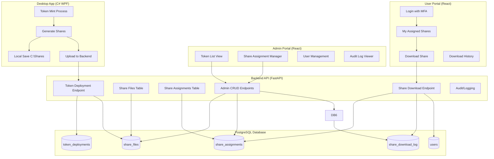
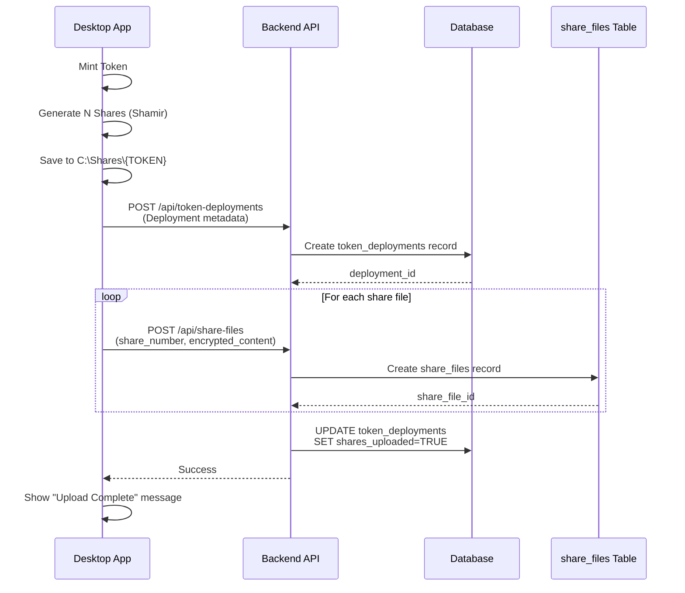
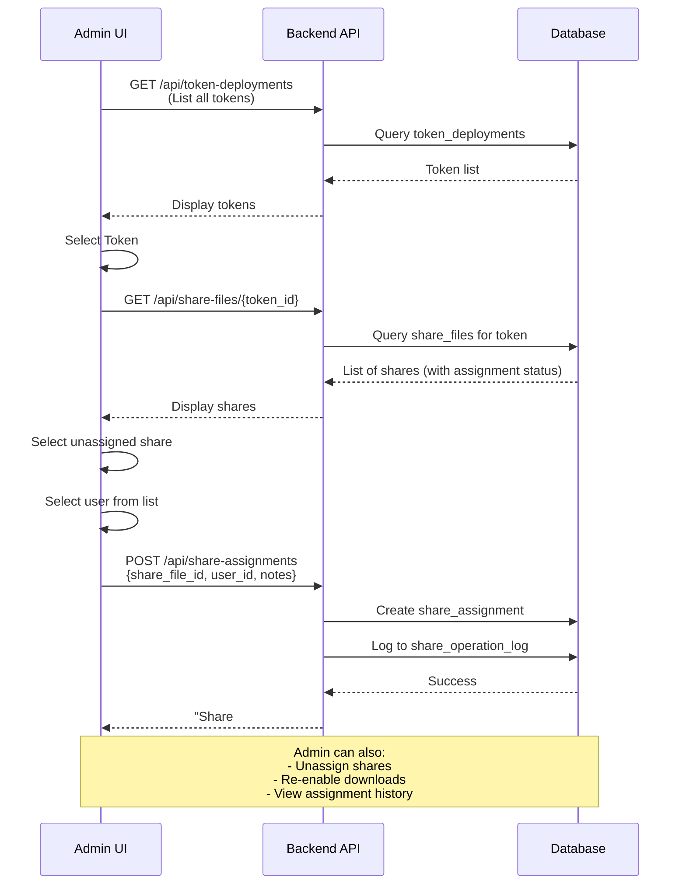
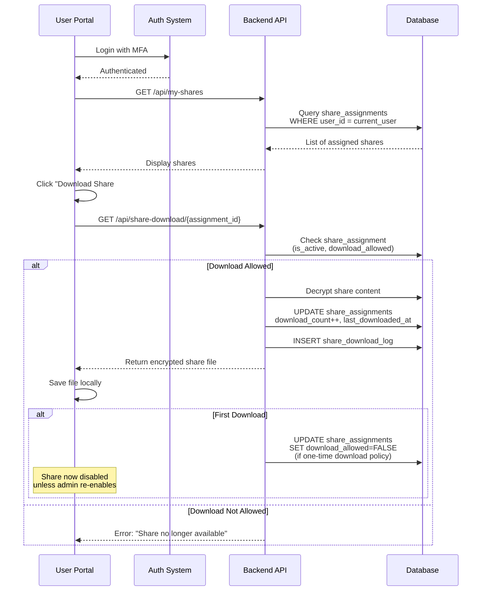
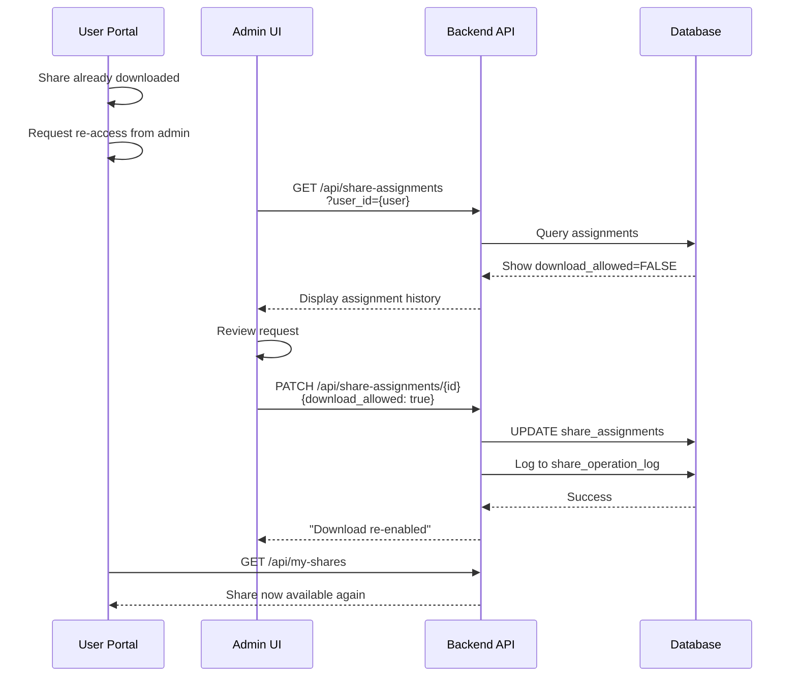

# Aegis Mint - Share Management System Flowchart

**Version:** 1.0  
**Created:** 2026-01-24  
**Last Updated:** 2026-01-24

---

## 📋 Table of Contents
- [System Overview](#system-overview)
- [Current State Analysis](#current-state-analysis)
- [Architecture Diagram](#architecture-diagram)
- [Database Schema](#database-schema)
- [Flow Diagrams](#flow-diagrams)
- [API Endpoints](#api-endpoints)
- [Security Considerations](#security-considerations)
- [Implementation Phases](#implementation-phases)

---

## 🎯 System Overview

### Purpose
Create a secure web-based system for managing and distributing Shamir secret shares to governance authority users, with admin oversight and download tracking.

### Key Features
1. **Admin Portal**
   - View all token deployments
   - Manage share assignments (CRUD)
   - Assign one share per user
   - Re-enable downloaded shares
   - Audit trail of all operations

2. **User Portal**
   - View assigned shares
   - Download share files (one-time by default)
   - Track download history
   - Secure authentication with MFA

---

## 🔍 Current State Analysis

### Existing Components

#### Desktop Application (C# WPF)
- **Location:** `Mint/src/AegisMint.Mint/MainWindow.xaml.cs`
- **Share Generation Process:**
  1. Generates Shamir secret shares during token deployment
  2. Creates share files: `aegis-share-001.json`, `aegis-share-002.json`, etc.
  3. Stores in local directory: `C:\Shares\{TOKEN-NAME}\`
  4. Each share file contains:
     ```json
     {
       "createdAtUtc": "2026-01-24T10:30:00Z",
       "network": "sepolia",
       "totalShares": 5,
       "threshold": 3,
       "clientShareCount": 2,
       "safekeepingShareCount": 3,
       "share": "001-<hex-value>",
       "encryptedMnemonic": "<encrypted-hex>",
       "iv": "<initialization-vector>",
       "encryptionVersion": 1,
       "tokenAddress": "0x..."
     }
     ```

#### Backend API (Python FastAPI)
- **Location:** `Web/backend/app/`
- **Current Tables:**
  - `token_deployments` - Stores deployment metadata
  - `users` - Authentication and role management
  - `assignments` (governance_assignments) - Share assignments
  - `share_operation_log` - Audit logging

- **Current `token_deployments` Schema:**
  ```python
  - id (UUID)
  - token_name, token_symbol, token_decimals, token_supply
  - network, contract_address, treasury_address
  - gov_shares, gov_threshold, total_shares
  - client_share_count, safekeeping_share_count
  - shares_path (local path on desktop)
  - encrypted_mnemonic (Base64 encrypted)
  - encrypted_shares (Base64 encrypted JSON array) ⚠️ Current backup
  - encryption_version
  ```

### Current Share Storage Issue
- **Problem:** `encrypted_shares` column stores ALL shares in one encrypted blob
- **Limitation:** Cannot individually assign/track shares
- **Desktop Storage:** Individual files in `C:\Shares\{TOKEN-NAME}\` but not in database

---

## 🏗️ Architecture Diagram



---

## 💾 Database Schema

### New Tables

#### 1. `share_files`
Stores individual share files separately (replacing bulk `encrypted_shares` column).

```sql
CREATE TABLE share_files (
    id UUID PRIMARY KEY DEFAULT gen_random_uuid(),
    token_deployment_id UUID NOT NULL REFERENCES token_deployments(id) ON DELETE CASCADE,
    share_number INTEGER NOT NULL,  -- 1, 2, 3, etc.
    file_name VARCHAR(255) NOT NULL,  -- aegis-share-001.json
    encrypted_content TEXT NOT NULL,  -- Base64 encrypted share JSON
    encryption_key_id VARCHAR(128),  -- Reference to key used for encryption
    created_at_utc TIMESTAMP WITH TIME ZONE DEFAULT NOW(),
    
    UNIQUE(token_deployment_id, share_number),
    INDEX idx_share_files_token (token_deployment_id)
);
```

#### 2. `share_assignments`
Maps shares to users with download tracking.

```sql
CREATE TABLE share_assignments (
    id UUID PRIMARY KEY DEFAULT gen_random_uuid(),
    share_file_id UUID NOT NULL REFERENCES share_files(id) ON DELETE CASCADE,
    user_id UUID NOT NULL REFERENCES users(id) ON DELETE CASCADE,
    assigned_by UUID NOT NULL REFERENCES users(id),  -- Admin who assigned
    assigned_at_utc TIMESTAMP WITH TIME ZONE DEFAULT NOW(),
    
    is_active BOOLEAN DEFAULT TRUE,  -- Can be downloaded
    download_allowed BOOLEAN DEFAULT TRUE,  -- Admin can disable
    
    -- Download tracking
    download_count INTEGER DEFAULT 0,
    first_downloaded_at_utc TIMESTAMP WITH TIME ZONE NULL,
    last_downloaded_at_utc TIMESTAMP WITH TIME ZONE NULL,
    
    -- Notes
    assignment_notes TEXT,
    
    UNIQUE(share_file_id, user_id),  -- One share per user only
    INDEX idx_share_assignments_user (user_id),
    INDEX idx_share_assignments_share (share_file_id),
    INDEX idx_share_assignments_active (is_active, download_allowed)
);
```

#### 3. `share_download_log`
Audit trail of all download attempts.

```sql
CREATE TABLE share_download_log (
    id UUID PRIMARY KEY DEFAULT gen_random_uuid(),
    share_assignment_id UUID NOT NULL REFERENCES share_assignments(id) ON DELETE CASCADE,
    user_id UUID NOT NULL REFERENCES users(id),
    
    downloaded_at_utc TIMESTAMP WITH TIME ZONE DEFAULT NOW(),
    ip_address VARCHAR(45),  -- IPv4/IPv6
    user_agent TEXT,
    success BOOLEAN DEFAULT TRUE,
    failure_reason TEXT NULL,
    
    INDEX idx_download_log_user (user_id),
    INDEX idx_download_log_assignment (share_assignment_id),
    INDEX idx_download_log_timestamp (downloaded_at_utc)
);
```

### Modified Tables

#### Update `token_deployments`
```sql
-- Keep existing columns
-- Add new columns:
ALTER TABLE token_deployments 
ADD COLUMN shares_uploaded BOOLEAN DEFAULT FALSE,
ADD COLUMN upload_completed_at_utc TIMESTAMP WITH TIME ZONE NULL,
ADD COLUMN share_files_count INTEGER DEFAULT 0;

-- NOTE: encrypted_shares column remains for backward compatibility but will be deprecated
```

---

## 🔄 Flow Diagrams

### 1. Token Deployment & Share Upload Flow



### 2. Admin Assignment Flow



### 3. User Download Flow



### 4. Admin Re-enable Download Flow



---

## 🔌 API Endpoints

### Share Management Endpoints

#### Desktop App Endpoints

```http
POST /api/token-deployments
Body: {token metadata, encrypted_mnemonic, etc.}
Returns: {deployment_id, ...}

POST /api/share-files/bulk
Body: {
  token_deployment_id: "uuid",
  shares: [
    {share_number: 1, file_name: "aegis-share-001.json", encrypted_content: "base64..."},
    {share_number: 2, file_name: "aegis-share-002.json", encrypted_content: "base64..."},
    ...
  ]
}
Returns: {created_count: 5, share_file_ids: [...]}
```

#### Admin Endpoints (Require SuperAdmin role)

```http
GET /api/admin/tokens
Query: ?network=sepolia&limit=50
Returns: [{deployment_id, token_name, created_at, shares_count, assigned_count}, ...]

GET /api/admin/tokens/{deployment_id}/shares
Returns: [{
  share_id, share_number, file_name,
  assignment: {user_email, assigned_at, download_count, download_allowed} | null
}, ...]

POST /api/admin/share-assignments
Body: {share_file_id, user_id, assignment_notes}
Returns: {assignment_id, ...}

GET /api/admin/share-assignments
Query: ?token_id={uuid}&user_id={uuid}&status=unassigned
Returns: [{assignment details with user and share info}, ...]

PATCH /api/admin/share-assignments/{assignment_id}
Body: {download_allowed: true/false, assignment_notes: "..."}
Returns: {updated assignment}

DELETE /api/admin/share-assignments/{assignment_id}
Returns: {success: true}

GET /api/admin/users
Query: ?role=GovernanceAuthority&is_active=true
Returns: [{user_id, email, role, created_at}, ...]
```

#### User Endpoints (Require GovernanceAuthority role)

```http
GET /api/my-shares
Returns: [{
  assignment_id, share_number, token_name, network,
  assigned_at, download_count, download_allowed, last_downloaded_at
}, ...]

GET /api/share-download/{assignment_id}
Returns: File download (application/json)
Headers: Content-Disposition: attachment; filename="aegis-share-003.json"

GET /api/my-shares/history
Returns: [{assignment_id, token_name, download_log: [{downloaded_at, ip_address}, ...]}, ...]
```

---

## 🔒 Security Considerations

### Encryption Strategy
1. **Share Content Encryption:**
   - Use AES-256-GCM for encrypting individual share files
   - Encryption key derived from vault master key
   - Each share gets unique encryption (different IV)

2. **Storage:**
   - Store encrypted content in `share_files.encrypted_content`
   - Never store plaintext shares in database
   - Decrypt only during download request

### Access Control
1. **Admin Operations:**
   - Only `SuperAdmin` role can assign/unassign shares
   - All admin actions logged to `share_operation_log`
   - MFA required for admin actions

2. **User Downloads:**
   - Only `GovernanceAuthority` role can download
   - User can only download shares assigned to them
   - MFA verification before download
   - IP address and user agent logged

### Audit Trail
- Every assignment: WHO assigned WHAT to WHOM and WHEN
- Every download: WHO downloaded WHAT from WHERE and WHEN
- Every status change: WHO enabled/disabled downloads WHEN
- Immutable logs (no DELETE allowed)

### Download Policies
- **One-time Download (Default):** `download_allowed` set to FALSE after first download
- **Re-enable:** Admin can set `download_allowed` back to TRUE
- **Multi-download:** Admin can configure assignment to allow unlimited downloads
- **Expiration:** (Future) Add `expires_at_utc` column for time-limited access

---

## 📅 Implementation Phases

### Phase 1: Database & Core API ✅ (Current Phase)
- [x] Design database schema
- [x] Create flowchart document
- [ ] Create Alembic migration for new tables
- [ ] Implement share_files upload endpoint
- [ ] Implement admin CRUD endpoints
- [ ] Implement user download endpoints
- [ ] Add unit tests

### Phase 2: Desktop App Integration
- [ ] Modify `MainWindow.xaml.cs` to upload shares individually
- [ ] Add progress indicator for share upload
- [ ] Add error handling for upload failures
- [ ] Keep backward compatibility with encrypted_shares column

### Phase 3: Admin Portal UI
- [ ] Create token list view with filters
- [ ] Create share assignment interface
- [ ] Create user management interface
- [ ] Create audit log viewer
- [ ] Add real-time notifications

### Phase 4: User Portal UI
- [ ] Create user login with MFA
- [ ] Create "My Shares" dashboard
- [ ] Create download interface with confirmation
- [ ] Create download history view
- [ ] Add email notifications on assignment

### Phase 5: Advanced Features
- [ ] Share expiration dates
- [ ] Bulk assignment operations
- [ ] Share transfer between users (with approval)
- [ ] Export audit reports
- [ ] Telegram/Slack notifications
- [ ] Emergency revocation (admin can instantly disable all shares)

---

## 📊 Metrics & Monitoring

### Key Metrics to Track
- Total tokens deployed
- Total shares created
- Assignment rate (assigned vs unassigned)
- Download rate (downloaded vs available)
- Average time between assignment and download
- Failed download attempts
- Admin actions per day

### Alerts
- Unassigned shares older than 7 days
- Failed download attempts (potential attack)
- High number of re-enable requests (suspicious)
- Share assignment to inactive users

---

## 🧪 Testing Scenarios

### Test Cases

#### Admin Flow
1. ✅ Admin can view all tokens
2. ✅ Admin can see share assignment status
3. ✅ Admin can assign unassigned share to user
4. ✅ Admin cannot assign already-assigned share
5. ✅ Admin can unassign share
6. ✅ Admin can re-enable downloaded share
7. ✅ All admin actions are logged

#### User Flow
1. ✅ User can view only assigned shares
2. ✅ User can download available share
3. ✅ User cannot download after download_allowed=FALSE
4. ✅ User cannot access shares of other users
5. ✅ Download increments download_count
6. ✅ Download creates log entry

#### Edge Cases
1. ✅ Handle concurrent assignment attempts
2. ✅ Handle concurrent download attempts
3. ✅ Handle deleted user (cascade delete assignments)
4. ✅ Handle deleted token (cascade delete shares and assignments)
5. ✅ Handle encryption/decryption failures

---

## 📝 Future Enhancements

1. **Multi-signature Approval:** Require 2+ admins to approve share assignments
2. **Geofencing:** Restrict downloads to specific IP ranges/countries
3. **Time Windows:** Allow downloads only during specific time periods
4. **Share Rotation:** Periodically regenerate shares with new split
5. **Mobile App:** Native iOS/Android app for secure share management
6. **Hardware Token:** Integrate with YubiKey for download authorization
7. **Emergency Procedures:** Automated share distribution in disaster scenarios

---

## 📚 References

- [Shamir Secret Sharing Algorithm](https://en.wikipedia.org/wiki/Shamir%27s_Secret_Sharing)
- [NIST Cryptographic Standards](https://csrc.nist.gov/)
- [OWASP Top 10](https://owasp.org/www-project-top-ten/)

---

**Document Status:** Living Document - Updated with each major implementation change  
**Next Review:** After Phase 1 completion
