# Aegis Mint - Share Management System

### Key Features
- **Admin:** Assign shares to users, manage permissions, view audit logs
- **User:** Download assigned shares (one-time by default), view history
- **Security:** MFA, role-based access, complete audit trail

---

## 📊 Current State

**Problem:** Desktop app generates shares as individual files (`C:\Shares\{TOKEN}\aegis-share-001.json`) but backend only stores them as one encrypted blob in `token_deployments.encrypted_shares`.

**Solution:** Store each share separately in database with individual assignment tracking.

---

## 🏗️ System Architecture

### Architecture Explanation

**Desktop Flow:**
1. User mints token via desktop app
2. App generates N shares using Shamir Secret Sharing
3. Shares saved locally in `C:\Shares\{TOKEN-NAME}\`
4. App uploads token metadata to backend
5. App uploads individual shares to backend

**Admin Flow:**
1. Admin views all tokens and their shares
2. Admin selects unassigned share
3. Admin assigns share to specific user
4. Assignment logged in audit trail

**User Flow:**
1. User logs in with MFA
2. User sees assigned shares
3. User downloads share (auto-disabled after download)
4. Download logged for audit

---

## 🔄 Detailed Flow Diagrams

### Flow 1: Token Deployment & Share Upload

**Explanation:**
1. Desktop app mints token and generates shares using Shamir Secret Sharing
2. Shares saved locally to C:\Shares\{TOKEN-NAME}\
3. Desktop uploads token deployment metadata
4. Desktop uploads all shares in bulk to backend
5. Backend stores each share separately in database

---

### Flow 2: Admin Assigns Share to User

```mermaid
sequenceDiagram
    participant Admin as Admin UI
    participant API as Backend API
    participant DB as MySQL
    
    Admin->>API: GET /api/admin/tokens
    API->>DB: SELECT token_deployments
    API-->>Admin: List of tokens
    
    Admin->>Admin: Select Token X
    
    Admin->>API: GET /api/share-files/token/{id}
    API->>DB: SELECT share_files<br/>with assignment status
    API-->>Admin: [Share #1 ✅ assigned]<br/>[Share #2 ⭕ unassigned]<br/>[Share #3 ⭕ unassigned]
    
    Admin->>Admin: Select Share #2
    Admin->>Admin: Select User Y
    
    Admin->>API: POST /api/admin/share-assignments<br/>{share_file_id, user_id}
    API->>DB: INSERT share_assignments
    API->>DB: INSERT share_operation_log
    API-->>Admin: ✅ Assigned
    
    Note over Admin,DB: Admin can also:<br/>- Unassign shares<br/>- Re-enable downloads<br/>- View assignment history
```

**Explanation:**
1. Admin views all tokens in the system
2. Admin selects a token to manage its shares
3. API shows which shares are assigned/unassigned
4. Admin picks unassigned share and target user
5. System creates assignment and logs the action
6. User can now see and download this share

---

### Flow 3: User Downloads Share

```mermaid
sequenceDiagram
    participant User as User Portal
    participant API as Backend API
    participant DB as MySQL
    
    User->>API: GET /api/my-shares<br/>(with MFA token)
    API->>DB: SELECT share_assignments<br/>WHERE user_id = current
    API-->>User: [Token X - Share #2]<br/>✅ Available
    
    User->>User: Click Download
    
    User->>API: GET /api/share-download/{id}
    API->>DB: CHECK download_allowed
    
    alt Download Allowed
        API->>DB: SELECT encrypted_content
        API->>DB: UPDATE download_count++
        API->>DB: SET download_allowed=FALSE
        API->>DB: INSERT share_download_log
        API-->>User: aegis-share-002.json
        User->>User: Save to disk
        Note over User: ⚠️ Share now disabled<br/>until admin re-enables
    else Download Blocked
        API-->>User: ❌ Error: Already downloaded
    end
```

**Explanation:**
1. User logs in with MFA and views assigned shares
2. User clicks download button for a share
3. API checks if download is allowed
4. If allowed: User gets file, download counter increments
5. **Important:** After first download, `download_allowed=FALSE`
6. User cannot download again unless admin re-enables
7. All attempts logged in `share_download_log`

---

### Flow 4: Admin Re-enables Download

**Explanation:**
1. User contacts admin (lost file, needs re-download)
2. Admin views user's assignment history
3. Admin sees share was downloaded and is now blocked
4. Admin re-enables download permission
5. Action is logged for audit trail
6. User can now download the share again

---
