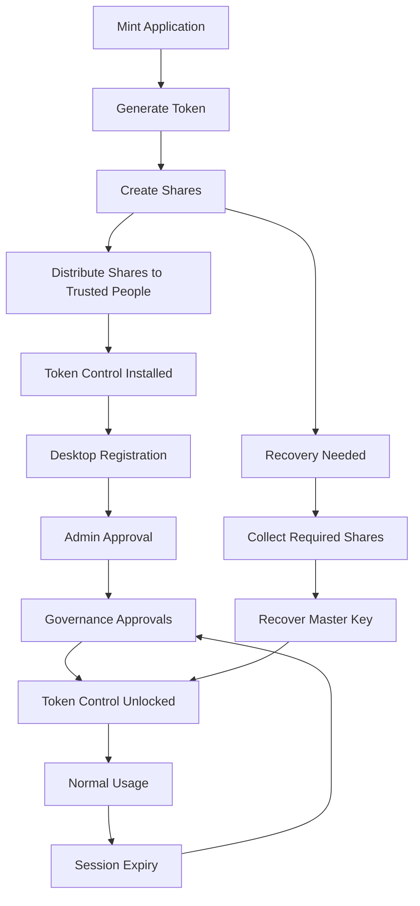

# AegisMint Token Control – User‑Friendly Test Plan
(Non‑Technical)

---

## PURPOSE OF THIS DOCUMENT

This document explains **how to test the AegisMint system end‑to‑end** in clear, simple language.
You do **not** need to understand cryptography, blockchain, or security internals to follow this guide.

If something looks “stuck” or “locked”, it is **usually expected behavior**, not a failure.

---

## SYSTEM OVERVIEW (IN SIMPLE TERMS)

The system has **three parts**:

1. **Mint Application**
   - Used once to create the token and security shares
2. **Token Control Application**
   - Used on desktops to manage the token
   - This app locks and unlocks based on approvals
3. **Governance Website**
   - Used by admins and approvers to grant access

---

## WHO DOES WHAT

- **Admin**
  - Approves computers
  - Assigns who can approve access

- **Governance Users**
  - Approve access requests

- **Token Control User**
  - Uses the desktop app
  - Waits for approvals

- **Test Users**
  - Admin: admin@example.com / ChangeMe123!
  - Governance: gov@example.com / GovPass123!
  - Governance: new2@example.com / finebyme@400users

---

# TEST SCENARIO 1 – Mint Application (One‑Time Setup)

## What This Step Is For (Important)

This scenario creates **two critical things**:
1. The token itself
2. **Recovery shares**, which are needed later in [Test Scenario 3](#test-scenario-3--recovering-the-token)

These shares are **not used every day**.
They are only needed for **recovery or disaster situations**.

---

## Step 1.1 – Start Mint

1. Open the **Mint** application

You should see:
- A window opens
- Only the **Generate Treasury** button is enabled

---

## Step 1.2 – Generate Treasury Address

1. Click **Generate Treasury**

You should see:
- A wallet address appears

This address must have test ETH before continuing.

---

## Step 1.3 – Mint Token and Create Shares

1. Enter:
   - Token name
   - Total supply
   - Decimals
   - Number of shares
   - Shares required to recover
2. Click **Mint Token**
3. Save the generated share files

You should see:
- A contract address appears
- Minting completes successfully

---

## Step 1.4 – What Are Shares?

Shares are **pieces of a master key**.

- One share alone does **nothing**
- No single person can control the token
- A minimum number of shares must be combined to recover access

Think of shares like **parts of a safe combination**.

---

## Step 1.5 – How to Store and Distribute Shares

- Give **one share per trusted person**
- Store shares in different locations
- Never email or centrally store all shares

---

## Step 1.6 – When Shares Are Needed Again

Shares are only required when:
- Recovering the token ([Test Scenario 3](#test-scenario-3--recovering-the-token))
- Rebuilding access after a disaster

---

## Step 1.7 – Finish Mint Setup

- Mint can be closed or uninstalled
- Shares must remain safely stored
- Continue to Token Control

---

### [Scenario 1 → See Appendix A](#appendix-a--shares--recovery-explained-one-page)

---

# TEST SCENARIO 2 – Desktop Registration & Access Approval

## IMPORTANT

Token Control may be locked for **normal reasons**:
1. New computer
2. Approvals missing
3. Session expired
4. New version installed

A lock screen does **not** mean failure.

---

## Step 2.1 – Launch Token Control

1. Open **Token Control**

You will see:
- A lock icon
- “Checking authorization…”

### Possible outcomes

**A. New computer**
- Message says it is registered and pending approval
- App closes automatically

**B. Already registered**
- Message says approvals are required
- App stays open

**C. Already approved**
- App unlocks immediately

---

## Step 2.2 – Admin Verifies Registration

1. Admin logs into the governance website
2. Opens **Manage Desktops**

You should see:
- The computer listed
- Status = Pending

---

## Step 2.3 – Admin Approves Computer

1. Admin clicks **Approve**

Result:
- Status becomes **Active**

---

## Step 2.4 – Admin Assigns Approvers

1. Admin opens **Assign Desktops**
2. Selects the computer
3. Assigns two governance users
4. Saves

---

## Step 2.5 – Request Access

1. Relaunch Token Control

You will see:
- Locked screen
- Approval count (0 of 2)

---

## Step 2.6 – First Approval

1. Governance user #1 logs in
2. Clicks **Approve**

Result:
- Status shows 1 of 2
- App remains locked

---

## Step 2.7 – Second Approval

1. Governance user #2 logs in
2. Clicks **Approve**

Result:
- Status shows 2 of 2
- Countdown timer starts

---

## Step 2.8 – Automatic Unlock

1. Wait up to 30 seconds

Result:
- App unlocks
- Timer visible in title bar

---

## Step 2.9 – Session Expiry

When timer ends:
- App locks again
- Approvals reset

This is expected.

---

# TEST SCENARIO 3 – Recovering the Token
(Connection to Shares Created in Scenario 1)

## What This Step Is For (Important)

This scenario uses the **shares created in Test Scenario 1**.
It confirms that multiple trusted people can jointly recover access.

### Important
- This scenario is required when new desktop needed
- Install Token Control on new desktop
- Follow the Step 2.1 to Step 2.8 from [Test Scenario 2](#test-scenario-2--desktop-registration--access-approval)
- Once application is unlocked then follow Step 3.1
---

## Step 3.1 – Start Recovery

1. Open **Token Control**
2. Ensure the application is unlocked
3. Click **Recover**
4. Provide the minimum required shares

You should see:
- Wallet address appears
- Contract address loads
- Balances display

---

### [Scenario 1 → See Appendix A](#appendix-a--shares--recovery-explained-one-page)

---

# TEST SCENARIO 4 – Admin Portal Basics

Admin can:
- Manage users
- Manage desktops
- Assign approvals

---

# TEST SCENARIO 5 – Governance Portal

Governance users can:
- Approve access
- Monitor timers

---

# TEST SCENARIO 6 – Multiple Desktops

The system supports:
- Multiple computers
- Independent approvals
- Independent timers

---

# IMPORTANT THINGS TO REMEMBER

- Lock screens are normal
- Approvals expire by design
- Shares are only used for recovery
- Restarting does not bypass security

---

# END OF TEST PLAN

# Appendix A – Shares & Recovery Explained (One Page)

## What Are Shares?

Shares are **pieces of a master key** created when the token is minted.

- A single share is **not useful on its own**
- No single person can control the token
- A minimum number of shares must be combined to recover access

Think of shares like **parts of a safe combination**:
- One person cannot open the safe
- A group must agree and work together

---

## Why Shares Exist

Shares exist to prevent:
- Single-person control
- Accidental loss of access
- Insider abuse

They ensure that **important actions require agreement**.

---

## How Shares Are Created

- Shares are created **once**, during the Mint process
- They are saved as files
- They are never sent to the server

---

## How Shares Should Be Distributed

Recommended best practices:
- One share per trusted person
- Different physical or secure digital locations
- No emailing or shared folders

Example holders:
- CTO
- Security Officer
- Compliance Officer
- External custodian (optional)

---

## When Shares Are Needed

Shares are **not needed for daily use**.

They are only used when:
- Recovering the token
- Rebuilding access after a failure
- Verifying ownership using Token Control recovery

---

## What Happens During Recovery

1. Token Control requests recovery
2. Trusted people provide their shares
3. Once the minimum number is reached:
   - The master key is reconstructed
   - Wallet and contract data are restored

---

## What If a Share Is Lost?

- As long as the minimum required shares exist, recovery still works
- If too many shares are lost, recovery is not possible

---

## About Shares

-- Useless without AegisMint applications
-- Protected by AES-256 encryption
-- Can only be decrypted by AegisMint applications

---

## Key Takeaway

Shares protect the system.
They make sure **no single mistake or person can break it**.

# Appendix B – AegisMint End-to-End Flow Diagram

